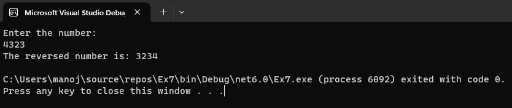

# Recursive-function

## Aim: 
To write a C# program to reverse a number using recursive function.

## Algorithm:
### Step 1: 
Create a class called reverse.

### Step 2: 
Create a recursive function named Revfun to reverse the number

### Step 3: 
In the function find reminder of the number and multiply it by 10 and add the reverse number.

### Step 4: 
Recusively call this function to get the reversed number.

### Step 5: 
Create a Main function

### Step 6: 
Get input from the user for the number to be reversed.

### Step 7: 
Call the function Revfun

### Step 8: 
End of the program.
## Program:
```
Developed By : Manoj Kumar S
Register Number : 212221230056
```

```c#
using System;
class Program
{
    public int rem, rev=0;
    static void Main(string[] args)
    {
        int num;
        Console.WriteLine("Enter the number:");  
        int reversenumber;
        num=Convert.ToInt32(Console.ReadLine());
        Program r = new Program();
        reversenumber = r.reversefun(num);
        Console.WriteLine("The reversed number is: "+reversenumber);

    }
    public int reversefun(int num)
    {
        if (num > 0) 
        {
            rem = num % 10;
            rev = rev * 10 +rem;
            return reversefun(num / 10);
        }
        return rev;
    }
}
```
## Output:

## Result:
Thus C# program to reverse a number using recursive function is written and executed sucessfully.